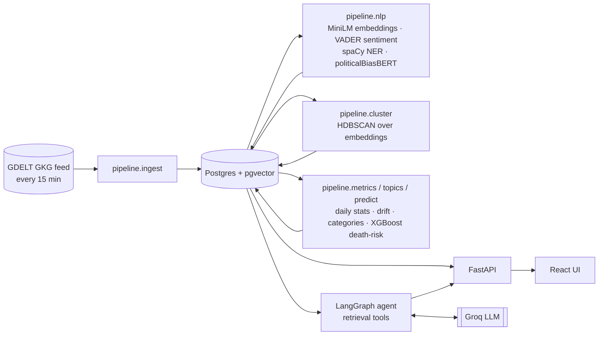

# ClearNews

[](https://github.com/K1NGS1LVER/ClearNews/actions/workflows/ci.yml)

News story lifecycle and narrative drift intelligence platform.
Tracks stories as living entities: how coverage was born, how framing and political lean shifted, and when the story died.
Includes an agentic RAG research assistant that answers questions with article citations.

<p align="center">
  
</p>

## Stack

React 19 + Vite + Recharts frontend (dark and light themes).
FastAPI + PostgreSQL/pgvector backend.
GDELT GKG ingestion every 15 minutes.
NLP pipeline: MiniLM embeddings, VADER sentiment, spaCy NER, politicalBiasBERT left/center/right scoring.
HDBSCAN story clustering, daily analytics, LangGraph + Groq chat agent.

## Architecture



`pipeline.scheduler` drives the loop: ingest every 15 minutes, NLP + clustering hourly, metrics/categories/death-risk nightly - each step is idempotent and safe to also run by hand (see [Local setup](#local-setup)).
The API only reads; all enrichment happens as background pipeline steps, not on the request path.

## Pages

**Story** — headline, bias bar, article coverage list, and lifecycle status.

<p align="center">
  
</p>

**Charts** — coverage volume timeline with forecast, lean share by day, VADER sentiment, narrative drift map, and drift score.

<p align="center">
  
</p>

**Agent sidebar** — RAG chat scoped to the story with suggested questions and cited answers.

<p align="center">
  
</p>

## Local setup

### Docker (recommended - same steps on macOS, Linux, and Windows)

No Homebrew/apt/uv/pnpm required, and it sidesteps the macOS OpenMP issue below entirely since Linux wheels don't collide the same way. Needs [Docker Desktop](https://www.docker.com/products/docker-desktop/) (macOS/Windows) or Docker Engine + Compose (Linux).

```bash
cp backend/.env.example backend/.env   # add your GROQ_API_KEY
docker compose up --build
# UI:  http://localhost:5173
# API: http://localhost:8000
```

This starts Postgres+pgvector, the API (runs `alembic upgrade head` on boot), the continuous ingestion/NLP/clustering scheduler, and the UI behind nginx.
Data takes the same calendar time to build up as the native setup (see [docs/DEMO.md](docs/DEMO.md)); `docker compose exec backend python -m pipeline.backfill 30 4` seeds recent history in one shot.

### Native setup

The backend (`uv`), frontend (`pnpm`), and data pipeline commands below are identical on every OS - the only platform-specific parts are installing Postgres+pgvector and starting it, called out per-OS.

**macOS**

```bash
brew install postgresql@17 pgvector
brew services start postgresql@17
createdb clearnews
```

**Linux (Debian/Ubuntu)**

```bash
sudo apt install postgresql postgresql-contrib postgresql-server-dev-17 build-essential git
# pgvector isn't in the default apt repo - build it from source (a few seconds):
git clone --branch v0.8.0 https://github.com/pgvector/pgvector.git /tmp/pgvector
cd /tmp/pgvector && make && sudo make install && cd -
sudo systemctl enable --now postgresql
sudo -u postgres createuser -s "$USER"   # let your OS user connect without a password prompt
createdb clearnews
```

Other distros: see [pgvector's install docs](https://github.com/pgvector/pgvector#installation) for the equivalent package/build step.

**Windows**

Native Windows isn't a well-trodden path for this stack (spacy/torch/hdbscan/umap/xgboost all expect a Linux-like build toolchain) and hasn't been tested here - use one of:
- **WSL2** (recommended): install Ubuntu via WSL, then follow the Linux instructions above inside it.
- **Docker Desktop**: see the Docker section above; works identically to macOS/Linux.

If you do run natively, replace `./dev.sh` in the last step with two terminals (`uv run uvicorn app.main:app --reload --port 8000` and `pnpm dev`) since it's a bash script.

**Backend, data, and frontend (all platforms)**

```bash
# backend
cd backend
cp .env.example .env          # add your GROQ_API_KEY for chat/summaries
uv sync
uv run python scripts/unify_libomp.py  # macOS ONLY - REQUIRED after every uv sync:
                                       # torch + sklearn each bundle an OpenMP
                                       # runtime; two in one process segfault.
                                       # Skip this on Linux/Windows.
uv run alembic upgrade head            # creates the vector extension, tables, indexes

# data (each step is idempotent)
uv run python -m pipeline.ingest      # pull latest 15-min GDELT file
uv run python -m pipeline.nlp         # embed + sentiment + NER + bias
uv run python -m pipeline.cluster     # group articles into stories
uv run python -m pipeline.metrics     # daily metrics, drift, status
uv run python -m pipeline.scheduler   # or: continuous 15-min ingestion

# run
cd ../frontend && pnpm install && cd ..
./dev.sh   # starts API :8000 and UI :5173 together, Ctrl-C stops both (macOS/Linux/WSL)

# tests
cd backend && uv run pytest
```

### Production env vars

Unset for local dev and docker-compose; set both only when actually serving over HTTPS behind a real domain (`ENV=production` makes the session cookie `Secure`, which browsers silently drop over plain HTTP):

- `ENV=production` - marks the session cookie `Secure`.
- `FRONTEND_ORIGIN=https://app.example.com` - comma-separated allowed origins; only needed when the frontend is hosted on a different origin than the API (not needed behind the docker-compose nginx proxy, which serves both same-origin).

### Deploying

Free-tier setup on Vercel (frontend) + Render (API + scheduler) + Supabase (Postgres/pgvector) - see [docs/DEPLOY.md](docs/DEPLOY.md) for the full walkthrough (`render.yaml` and `frontend/vercel.json` are already in the repo).

## Layout

```
backend/app/       FastAPI app, SQLAlchemy models
backend/pipeline/  ingestion, NLP, clustering, analytics jobs
backend/agent/     LangGraph chat agent and retrieval tools
frontend/src/      Feed, Story, Chat, Analytics pages
```
