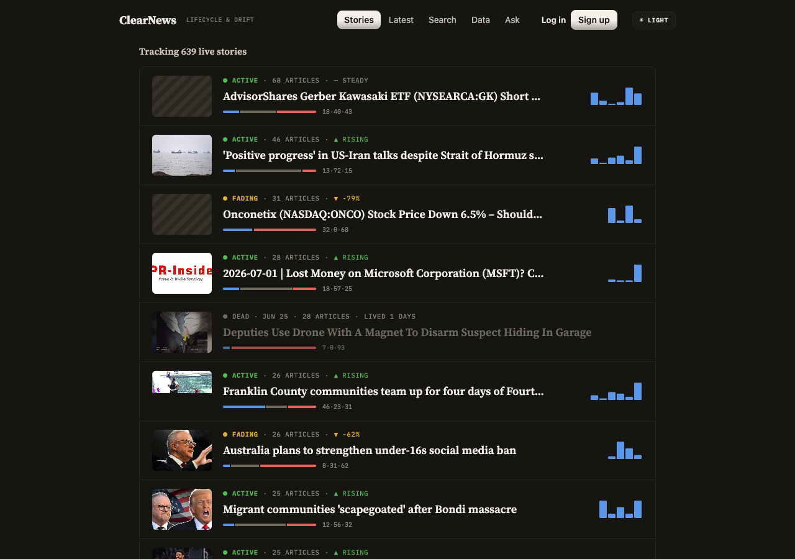
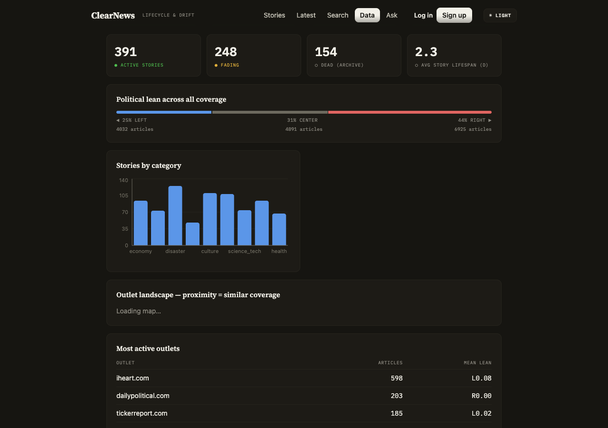
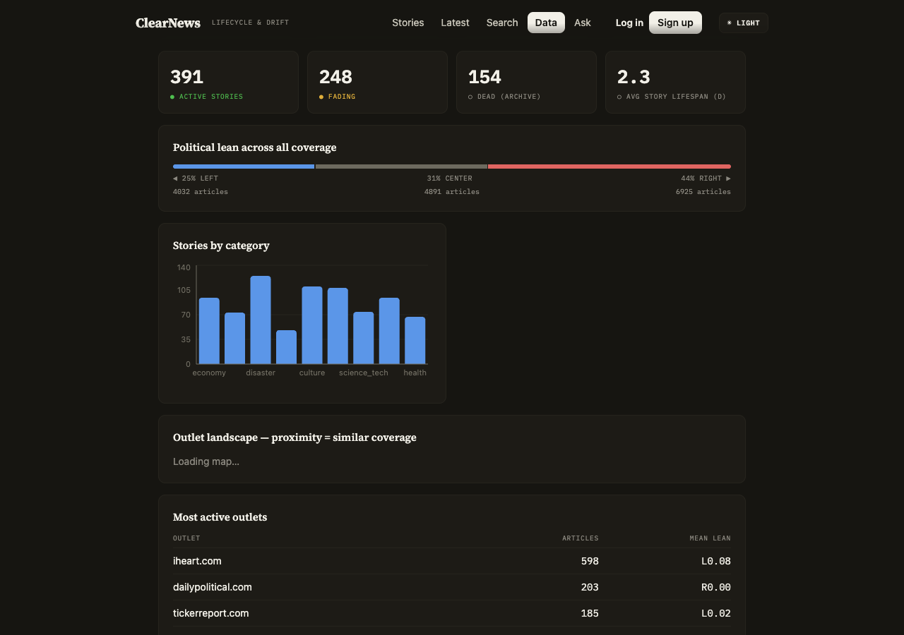

# ClearNews

News story lifecycle and narrative drift intelligence platform.
Tracks stories as living entities: how coverage was born, how framing and political lean shifted, and when the story died.
Includes an agentic RAG research assistant that answers questions with article citations.

<p align="center">
  
</p>

## Stack

React 19 + Vite + Recharts frontend (dark and light themes).
FastAPI + PostgreSQL/pgvector backend.
GDELT GKG ingestion every 15 minutes.
NLP pipeline: MiniLM embeddings, VADER sentiment, spaCy NER, politicalBiasBERT left/center/right scoring.
HDBSCAN story clustering, daily analytics, LangGraph + Groq chat agent.

## Pages

**Feed** — active, fading, and dead stories with bias bars, sparklines, and lifecycle status.

<p align="center">
  
</p>

**Story** — full arc: coverage volume, lean over time, sentiment trajectory, narrative drift map, outlet breakdown.

<p align="center">
  
</p>

**Analytics** — corpus-wide stats: stories by category, bias distribution, outlet landscape map, death-risk table.

<p align="center">
  
</p>

**Ask** — agentic RAG chat over the full archive (or scoped to a single story), answers with article citations.

<p align="center">
  
</p>

## Local setup

```bash
# database
brew install postgresql@17 pgvector
brew services start postgresql@17
createdb clearnews

# backend
cd backend
cp .env.example .env          # add your GROQ_API_KEY for chat/summaries
uv sync
uv run python scripts/unify_libomp.py  # REQUIRED after every uv sync (macOS):
                                       # torch + sklearn each bundle an OpenMP
                                       # runtime; two in one process segfault
uv run python -m app.init_db

# data (each step is idempotent)
uv run python -m pipeline.ingest      # pull latest 15-min GDELT file
uv run python -m pipeline.nlp         # embed + sentiment + NER + bias
uv run python -m pipeline.cluster     # group articles into stories
uv run python -m pipeline.metrics     # daily metrics, drift, status
uv run python -m pipeline.scheduler   # or: continuous 15-min ingestion

# run
cd ../frontend && pnpm install && cd ..
./dev.sh   # starts API :8000 and UI :5173 together, Ctrl-C stops both

# tests
cd backend && uv run pytest
```

## Layout

```
backend/app/       FastAPI app, SQLAlchemy models
backend/pipeline/  ingestion, NLP, clustering, analytics jobs
backend/agent/     LangGraph chat agent and retrieval tools
frontend/src/      Feed, Story, Chat, Analytics pages
```
